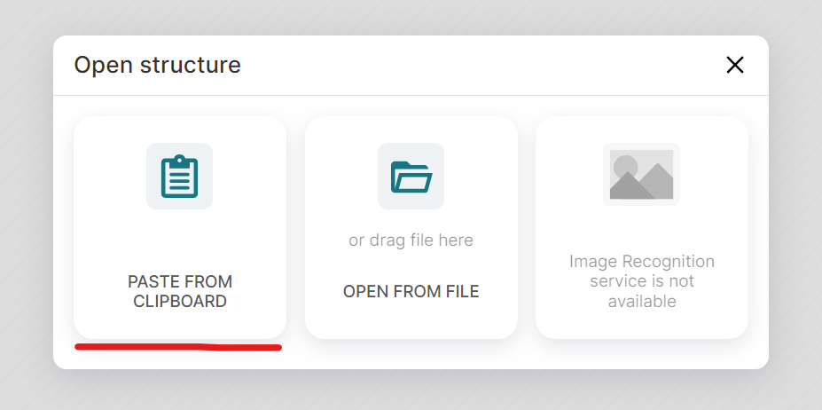

## Project of molecular activity prediction in CYP3A4 using Machine Learning
 

### Overview

This repository aims to provide the necessary scripts to run the application to predict the activity of small molecules in the CYP34A enzyme using a Machine Learning model.

### Table of contents

* [Installation](#installation)
* [How to use](#how-to-use)
* [Project structure](#requirements)


### Installation

To install the necessary dependencies to run the app in your computer the user needs to execute the following steps:

<b>1.</b> Clone this repository:
```bash
   git clone https://github.com/ewerton-cristhian/MachineLearning_Chemistry.git
```

<b>2.</b> Activate your virtual environment:
* On Windows:
```bash
.\<my-env>\Scripts\activate
```

* On macOS/Linux:
```bash
source <my-env>/bin/activate
```

* Anaconda distribution:
```bash
conda activate <my-env>
```

<b>3.</b> Install the required packages in your virtual environment:

```bash
pip install --no-cache-dir -r requirements.txt
```

<b>4.</b> Execute the Python application:
```bash
python app.py
```

After the execution, the application will be available in port 3000 of your web browser. To access the application, just type <b>http://localhost:3000/</b> in your browser.

### How to use

To use the aplication to predict CYP34A activity, the user must perform the following steps:

<div align="center">

<p><b>Figure 1</b>: Main screen of the application.</p>
</div>

<b>1.</b> Draw the required molecule using the tools available on the sketch screen (Figure 1).

<b>1. (Alternative input)</b> Upload your molecule in Smiles format pressing <b>Ctrl+O</b> and clicking on <b>PASTE FROM CLIPBOARD</B> button (Figure 2). On the next screen, the user must to paste the Smiles code of the molecule and press the button <b>Open as New Project</b> (Figure 3).

<b>2.</b> After draw or upload the molecule, the user must press the <b>Send</b> button to submit the molecule to the server. The result of the prediction will be displayed om the white box located on the right.

<div align="center">

<p><b>Figure 2</b>: Screen of the upload of Smiles code/file.</p>
</div>

<br>

<div align="center">

<p><b>Figure 3</b>: Screen of the text box to paste the Smiles code.</p>
</div>

### Project structure

Below is a summary of the organization of this project's files in the GitHub repository.


    ├── data               <- Data with molecules information.
    ├── figures            <- Figures of the python application screens.
    ├── lib                <- Python scripts used as support.
    ├── models             <- Trained machine learning models employed in this project.
    ├── static             <- Repository with statis scripts.
    │   ├── css            <- CSS scripts.
    │   └── js             <- JS scripts.
    ├── templates          <- Repository with templates of the application.
    │   ├── ketcher        <- Ketcher EPAM repository.
    │   └── home.html      <- Main script with front-end of the application.
    │
    ├── .gitignore          
    ├── model.ipynb         <- Notebook with machine learning model generation.
    ├── README.md          <- The README file with information about this project.
    ├── requirements.txt   <- Requirement file with python packages necesseries to execute the aplication.
    